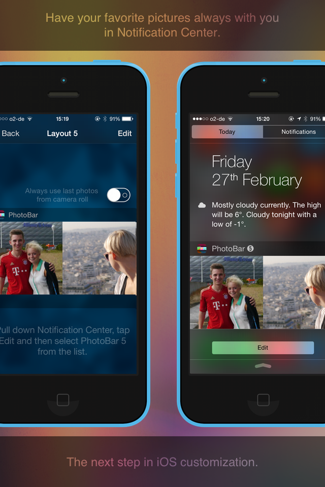

# PhotoBar

**The app is discontinued, this repository only serves to archive the code.**

## AppStore Description

PhotoBar is a completely new way to customize your iOS-device.

Your own images in Notification Center.

Choose from many different layouts or create your own, add your photos and be presented with a stunning view every time you open the Notification Center.

*Please note:
Some users have requested the ability to change the labels above the widgets. However, as of right now it is technically not possible for the end user to modify these labels. Apple does not give the ability to change these labels at runtime.

## Screenshots

 

 

